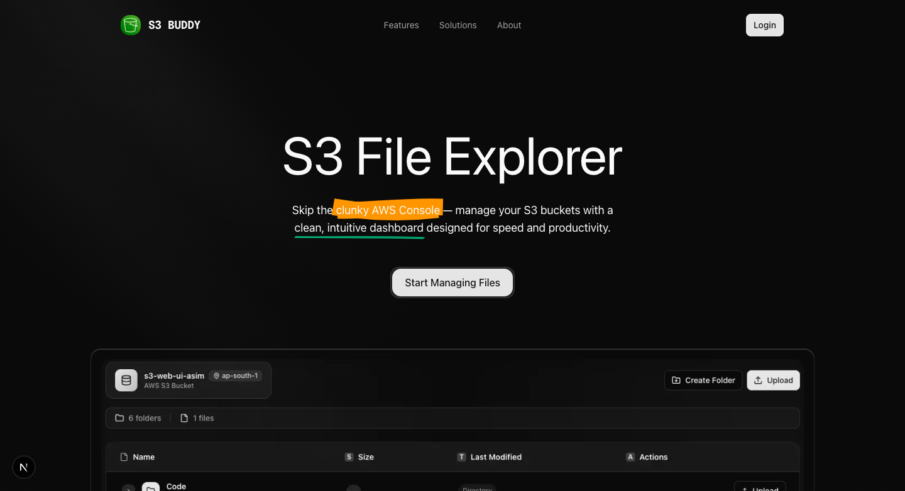

# S3 Buddy - Modern S3 File Manager

A beautiful, secure, and intuitive web interface for managing AWS S3 buckets and objects. Stop wrestling with the AWS Console's clunky interface and manage your S3 buckets through a clean, friendly dashboard built for speed and productivity.

## Screenshots

### Landing Page



_Clean and modern landing page with authentication flow powered by Clerk_

### File Explorer Dashboard


_Intuitive file explorer interface with drag-and-drop uploads, folder navigation, and real-time progress tracking_

## Table of Contents

- [About](#about)

- [Tech Stack](#tech-stack)

- [Features](#features)

- [What I Learned](#what-i-learned)

- [Usage](#usage)

- [Getting Started](#getting-started)

- [Prerequisites](#prerequisites)

- [Installation](#installation)

## About

S3 Buddy is a modern web application that provides an enterprise-grade interface for Amazon S3 storage management. Built with Next.js 15 and React 19, it offers a secure, encrypted credential management system and a beautiful user interface that makes S3 operations intuitive for both technical and non-technical users.

The application addresses the core problem of AWS Console's complex interface by providing:

- **Simplified S3 Management** - Easy file upload, download, and organization

- **Enterprise Security** - Encrypted AWS credential storage with zero-trust architecture

- **Modern UX** - Beautiful, responsive interface optimized for productivity

- **Real-time Operations** - Live upload progress and instant feedback

## Tech Stack

### Frontend

- **Next.js 15** - React framework with App Router and Server Components

- **React 19** - Latest React with concurrent features

- **Tailwind CSS v4** - Utility-first CSS framework

- **Framer Motion** - Smooth animations and transitions

- **Radix UI** - Accessible UI components

- **Lucide React** - Beautiful icon library

### Backend

- **Next.js API Routes** - Serverless API endpoints

- **AWS SDK v3** - Secure S3 operations

- **Drizzle ORM** - Type-safe database operations

- **Neon PostgreSQL** - Serverless PostgreSQL database

### Authentication & Security

- **Clerk** - Modern authentication and user management

- **Crypto-JS** - AES encryption for credential storage

- **Middleware Protection** - Route-based security

### Development Tools

- **TypeScript** - Type safety and better developer experience

- **Turbopack** - Fast development builds

- **ESLint** - Code quality and consistency

- **Drizzle Kit** - Database migration and management

## Features

### 🔐 Security First

- **Encrypted Credential Storage** - AWS credentials encrypted with AES before database storage

- **Zero-Trust Architecture** - Credentials decrypted only when needed

- **Secure Authentication** - Clerk-powered user management

- **Protected Routes** - Middleware-based route protection

### 📁 File Management

- **Drag & Drop Uploads** - Intuitive file upload experience

- **Folder Organization** - Create and manage virtual folder structures

- **Nested Navigation** - Expandable folder tree with lazy loading

- **Bulk Operations** - Upload multiple files simultaneously

- **File Download** - Secure proxy downloads with progress tracking

### 🎨 User Experience

- **Responsive Design** - Works seamlessly across all devices

- **Real-time Progress** - Live upload/download progress indicators

- **Empty State Handling** - Elegant empty bucket/folder states

- **Error Management** - Comprehensive error handling with user feedback

### ⚡ Performance

- **Server Components** - Optimized React Server Components

- **Lazy Loading** - Efficient folder content loading

- **Presigned URLs** - Direct S3 uploads without server overhead

- **CDN Optimized** - Fast global asset delivery

### 🛠️ Developer Features

- **Type Safety** - Full TypeScript implementation

- **Component Architecture** - Modular, reusable components

- **API Design** - RESTful endpoints with proper error handling

- **Database Migrations** - Automated schema management

## What I Learned

### Technical Skills

- **Next.js 15 Mastery** - Leveraged the latest App Router patterns and Server Components

- **AWS S3 Integration** - Implemented secure S3 operations with presigned URLs and proper credential management

- **Database Design** - Created normalized schema with encrypted sensitive data

- **Authentication Flow** - Integrated modern authentication with secure credential management

### Architecture Patterns

- **Serverless Architecture** - Built scalable serverless functions with Next.js API routes

- **Component-Based Design** - Created reusable, maintainable UI components

- **Security Best Practices** - Implemented encryption, middleware protection, and secure API design

- **State Management** - Efficient React state patterns for complex file operations

### Development Practices

- **Type-Driven Development** - Used TypeScript for better code quality and developer experience

- **Modern Tooling** - Leveraged Turbopack, Drizzle ORM, and modern development tools

- **User Experience Focus** - Prioritized UX with smooth animations, progress feedback, and intuitive design

- **Performance Optimization** - Implemented lazy loading, efficient rendering, and optimized API calls.

## Usage

1.  **Sign Up/Login** - Create an account or login using Clerk authentication

2.  **Configure AWS Credentials** - Securely add your AWS access keys and S3 bucket information

3.  **Browse Files** - Navigate through your S3 bucket using the file explorer

4.  **Upload Files** - Drag and drop files or click upload to add new files

5.  **Manage Folders** - Create folders and organize your files

6.  **Download Files** - Click on any file to download it securely

## Getting Started

### Prerequisites

Before running this project, make sure you have the following installed:

- **Node.js** (>= 18.x)

- **npm** / **yarn** / **pnpm** / **bun**

- **AWS Account** with S3 access

- **Clerk Account** for authentication

- **Neon PostgreSQL** database

### Installation

1.  **Clone the repository**

```bash
git clone https://github.com/asimar007/S3-Web-UI.git

cd s3-ui
```

2.  **Install dependencies**

```bash
npm install

# or

yarn install

# or

pnpm install
```

3.  **Set up environment variables**
    Create a `.env.local` file in the root directory:

```env
# Clerk Authentication
NEXT_PUBLIC_CLERK_PUBLISHABLE_KEY=your_clerk_publishable_key
CLERK_SECRET_KEY=your_clerk_secret_key

# Database
DATABASE_URL=your_neon_postgresql_connection_string

# Encryption
ENCRYPTION_SECRET=your_32_character_encryption_secret
```

4.  **Set up the database**

```bash
# Generate database migrations

npm run db:generate

# Push schema to database

npm run db:push

# (Optional) Open database studio
npm run db:studio
```

5.  **Start the development server**

```bash
npm run dev
# or
yarn dev
```

6.  **Open your browser**

Navigate to [http://localhost:3000](http://localhost:3000) to see the application.

### Build for Production

```bash
# Build the application

npm  run  build

# Start production server
npm  run  start
```
